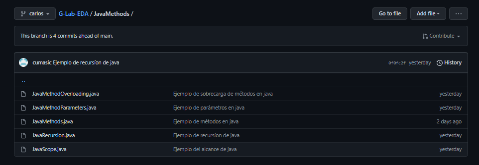

<!--
<table>
    <theader>
        <tr>
            <td></td>
            <th>
                UNIVERSIDAD NACIONAL DE SAN AGUSTIN 
                FACULTAD DE INGENIERÍA DE PRODUCCIÓN Y SERVICIOS 
                ESCUELA PROFESIONAL DE INGENIERÍA DE SISTEMAS
            </th>
            <td></td>
        </tr>
    </theader>
    <tbody>
        <tr><td colspan="3">Formato: Guía de Práctica de Laboratorio / Talleres / Centros de Simulación</td></tr>
        <tr><td>Aprobación:  2022/03/01</td><td>Código: GUIA-PRLD-001</td><td>Página: 1</td></tr>
    </tbody>
</table>

-->

    <h2>INFORME DE LABORATORIO</h2>

<table>
<theader>
    <tr><th colspan="6" style="width:50%; height:auto; text-align:center">INFORMACIÓN BÁSICA</th></tr>
</theader>
<tbody>
    <tr>
        <td>ASIGNATURA:</td><td colspan="5">Laboratorio de Estructura de Datos y Algoritmos</td>
    </tr>
    <tr>
        <td>TÍTULO DE LA PRÁCTICA:</td><td colspan="5">Revisión de elementos de programación (Parte I)</td>
    </tr>
    <tr>
        <td>NÚMERO DE PRÁCTICA:</td><td>01</td><td>AÑO LECTIVO:</td><td>2022 A</td><td>NRO. SEMESTRE:</td><td>III</td>
    </tr>
    <tr>
        <td colspan="2">FECHA DE PRESENTACIÓN:</td><td>10-May-2022</td><td colspan="2">HORA DE PRESENTACIÓN: 9pm</td><td></td>
    </tr>
    <tr>
        <td colspan="3">INTEGRANTES:
        <ol>
        <li>Umasi Cariapaza, Carlos Daniel</li>
        </ol>
        </td>
        <td colspan="2"> NOTA:</td>
        <td>     </td>
    </tr>
    <tr>
        <td colspan="6">DOCENTE: 
        Mg. Richart Smith Escobedo Quispe
        </td>
    </tr>
</tdbody>
</table>

<table>
    <theader>
        <tr>
            <th style="text-align:center">SOLUCIÓN Y RESULTADOS</th>
        </tr>
    </theader>
    <tbody>
        <tr>
            <td>
            I. SOLUCIÓN DE EJERCICIOS/PROBLEMAS 
            Repositorios personales 
            <ol>
                <li>Umasi Cariapaza, Carlos Daniel https://github.com/cumasic/Lab-EDA</li>
            </ol>
            Repositorio general 
            <ol>
                https://github.com/cumasic/G-Lab-EDA 
            </ol>
            Imagenes de Prueba: 
            Carpeta JavaTutorial 
               
            Carpeta JavaMethods 
               
            </td>
        </tr>
        <tr>
            <td>
            II. SOLUCIÓN DEL CUESTIONARIO 
            <b>¿Por qué Git y GitHub son herramientas importantes para el curso?</b> 
            Porque estas herramientas nos permitirán una me mejor coordinación a la hora de trabajar en grupo, algo muy necesario en nuestra carrera además nos permite revisar cualquier error que se cometa y probar ideas entre integrantes de un equipo y con ayuda de commits se podrá saber qué se cambió en un archivo o que se intentó hacer en este.
            <b>
            ¿Qué conductas éticas deberían promocionarse cuando se usa un Sistema de Control de Versiones?</b> 
            El respeto es algo fundamental en este tipo de Sistemas, la tolerancia también llega a ser importante debido a las demoras que se puedan dar y la solidaridad para con otras personas lo que ayuda en un trabajo en equipo.  
            <b>¿Qué son los estándares de codificación?</b> 
            Es un paradigma de programación que busca reducir el número de decisiones que el desarrollador tiene que tomar al momento de escribir su código. Con esto no se busca reducir la creatividad del desarrollador sino hacer más fácil el programar pues se establece un estándar que todos los programadores entienden.
            </td>
        </tr>
        <tr>
            <td>
            III. CONCLUSIONES 
                <ul>
                    <li>GitHub facilita la tarea de mantener un sistema de control de versiones en repositorios con proyectos que se comparten como otros personales, porque ofrece opciones utiles para los desarrolladores</li>
                    <li>Los códigos de ética son importantes ya que nos permiten un mejor trabajo en grupo por las normas que cada integrante cumple siendo estas útiles para un proyecto</li>
                    <li>Es correcto mantener un estandar en la codificación pues facilita en gran medida como los desarrolladores programan ya que al todos seguir un estandar se evita complicaciones</li>
                </ul>
            </td>
        </tr>
    </tbody>
</table>

<table>
    <theader>
        <tr>
            <th style="text-align:center">RETROALIMENTACIÓN GENERAL</th>
        </tr>
    </theader>
    <tbody>
        <tr>
            <td>
            </td>
        </tr>
    </tbody>
</table>

<table>
    <theader>
        <tr>
            <th style="text-align:center">REFERENCIAS Y BIBLIOGRAFÍA</th>
        </tr>
    </theader>
    <tbody>
        <tr>
            <td>
                [1] Escobedo, R., 2022. eda/labs/lab01 at main · rescobedoq/eda. [online] GitHub. Available at: https://github.com/rescobedoq/eda/tree/main/labs/lab01. 
                [2] Proyectos de tecnología con arduino, 2022. Manejo de ramas de Git, en vs code . (branch). [video] Available at: https://www.youtube.com/watch?v=k8UlMFtNDpE.
            </td>
        </tr>
    </tbody>
</table>

<!--
## COMPETENCIAS
- C.c Diseña responsablemente sistemas, componentes o procesos para satisfacer necesidades dentro de restricciones realistas: económicas, medio ambientales, sociales, políticas, éticas, de salud, de seguridad, manufacturación y sostenibilidad.
- C.m Construye responsablemente soluciones siguiendo un proceso adecuado llevando a cabo las pruebas ajustada a los recursos disponibles del cliente.
- C.p Aplica de forma flexible técnicas, métodos, principios, normas, estándares y herramientas de ingeniería necesarias para la construcción de software e implementación de sistemas de información.
-->